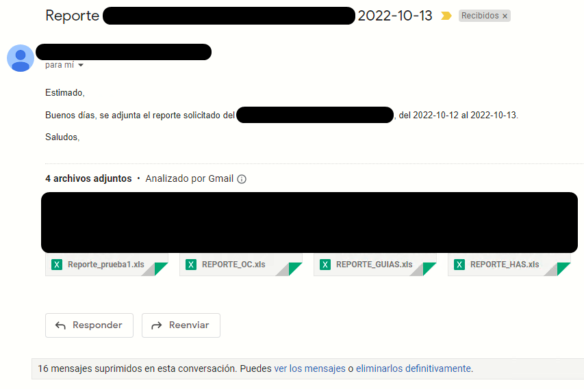
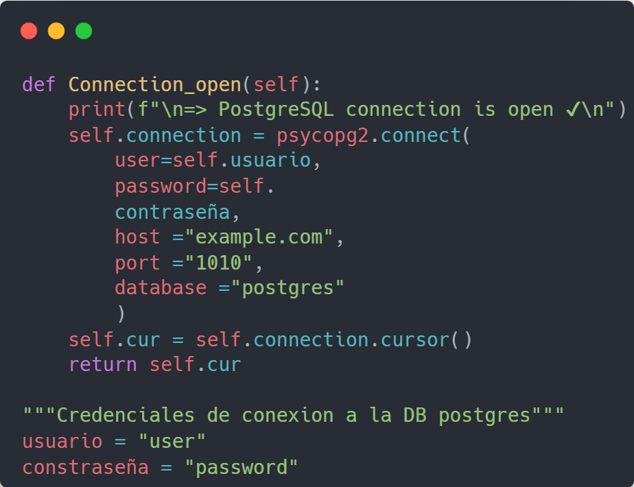
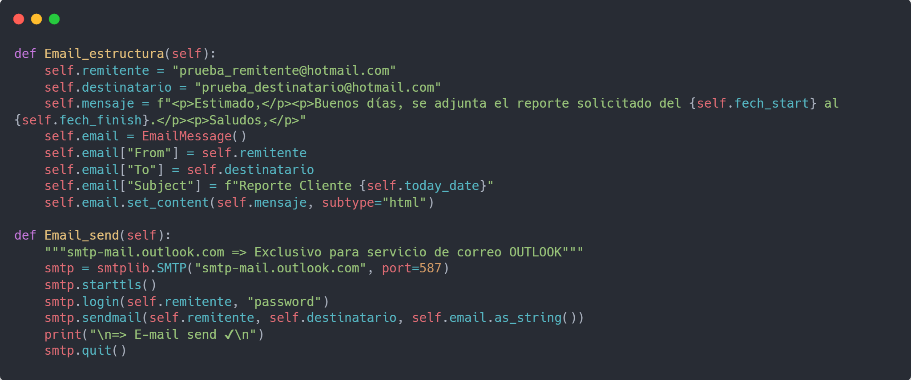

# Report-pgDB



El proyecto fue realizado con el fin de extraer reportes de forma automatica en un Excel y enviar estos adjuntos via correo.

*Las funcionalidades del programa se iran actualizando de forma constante de manera que sea escalable y reutilizable por cualquiera*

## Caracteristicas

- Realiza una conexion a una base de datos postgress
- Consulta mediante un query a la base de datos
- Iteramos en la consulta para extraer la informacion en columnas y filas
- Se genera un reporte en excel del resultado obtenido por el query
- Inicializamos un correo y con una estructura
- Adjuntamos los archivos .xls
- Se envia el correo con los adjuntos
- Por ultimo se borran los registros para no ocupar espacio, ya que estos reportes seran generados diariamente

## Librerias a instalar

```shell
pip install xlwt
pip install psycopg2
```

# Recordar

## Cambiar datos

Cambiar usuario y contraseña de la conexion a la base de datos.


Cambiar usuario y contraseña del correo remitente (debe ser un correo existente).

